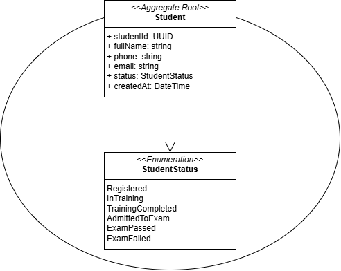
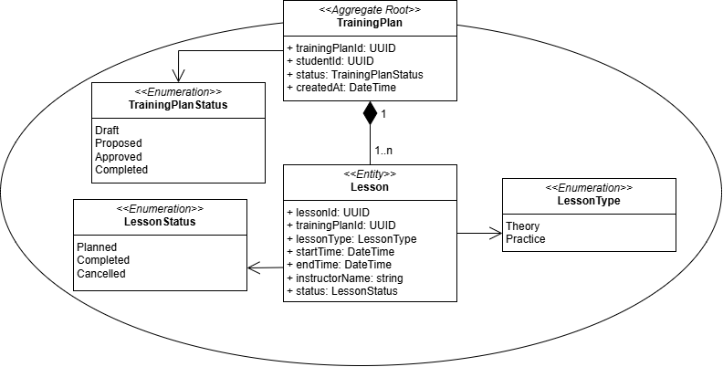
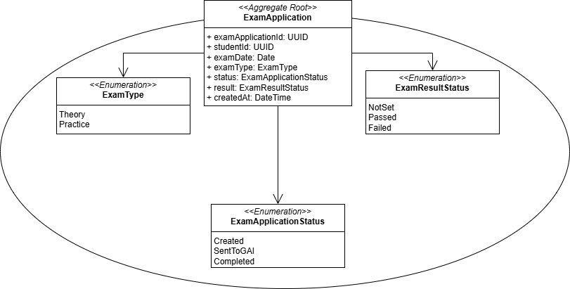
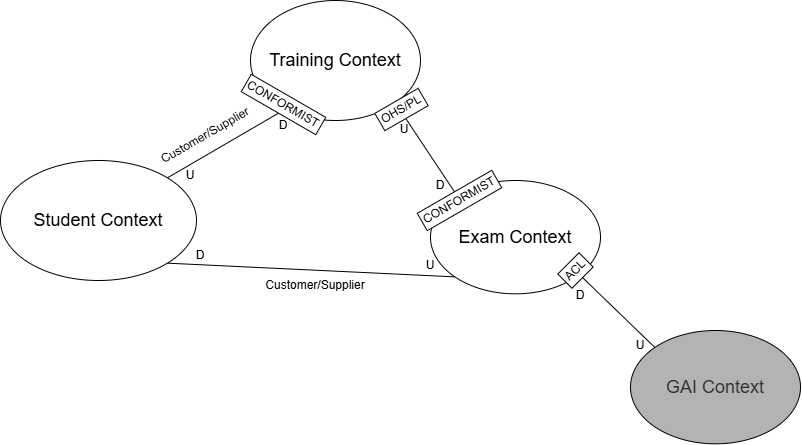

# Отчёт о выполнении ЛР№1

## Наименование работы

Построение модели предметной области, карты контекстов и формирование команд.

## Диаграмма контекста Student 

## Диаграмма контекста Training 

## Диаграмма контекста Exam 

## Обобщенная карта контекстов

## Выводы

Работа была выполнена для изучения подхода Domain-Driven Design и освоения принципов выделения bounded contexts, агрегатов и связей между контекстами на основе предметной области. В процессе выполнения работы были приобретены навыки анализа предметной области, построения user stories, проектирования карты контекстов и моделирования системы с использованием основных концепций DDD.
